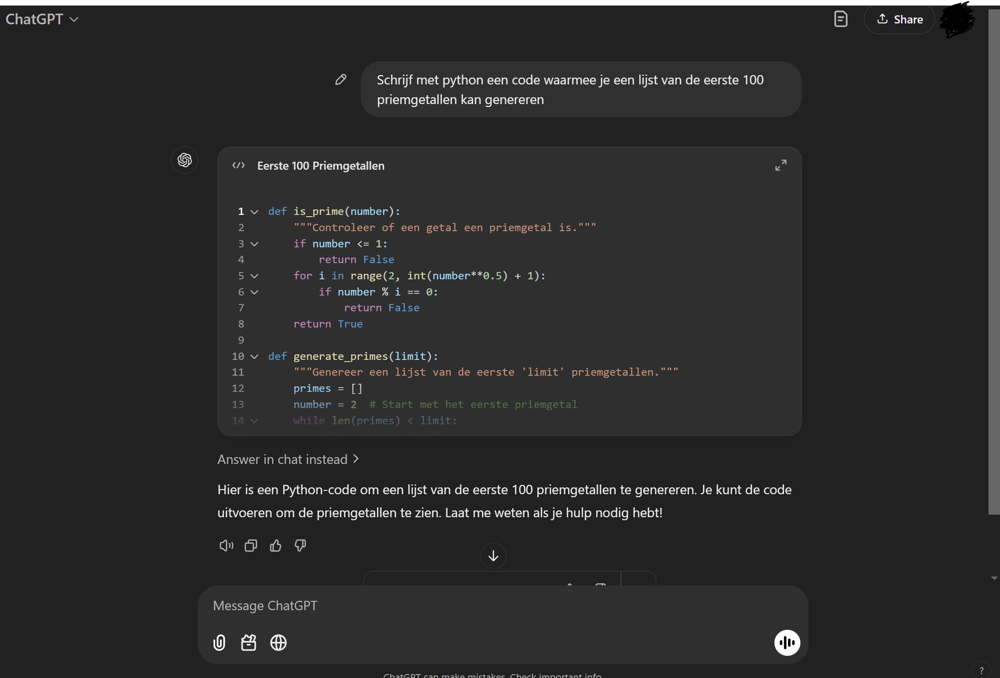

## Gebruik van ChatGPT

Het gebruik van ChatGPT is TOEGESTAAN.

In dit hoofdstuk licht ik toe HOE je het gebruikt en vooral wat je MOET doen als je er van gebruik maakt voor opdrachten.

# ChatGPT
Jullie zijn ongetwijfeld al bekend met CHatGPT. Maak een account aan (bijvoorbeeld je schoolaccount) en probeer eens wat uit. Het is echt een leuk programma.

Voor programmeren is ChatGPT ook zeker geschikt. 

# OPDRACHT
a) Vraag aan chatgpt hoe je om, met python, een lijst van de eerste 100 priemgetallen te genereren.

Als het goed is krijg je onderstaand figuur, misschien net even anders afhankelijk van welke (evt betaalde) versie van chatgpt nu bestaat.

b) Je kan vragen aan chat om elke regel toe te lichten. Iets als ''geef commentaar bij elke regel'' is meestal voldoende.

# Debuggen
Soms doet ChatGPT niet wat je wilt, door duidelijke intructies te geven wat er mis gaat maakt ChatGPT vaak wel een goede aanpassing. 
Ook als je een foutmelding krijgt, kan je deze foutmelding kopieren plakken in CHat en om verduidelijking geven.

Je kan ook je hele code aan chat geven en vragen naar verbetering. Zorg wel dat je BEGRIJPT wat de verbetering was en documenteer dat (zie verwijzing hieronder)

# Verwijzen bij opdrachten / werkstukken / code
Gewoon kopieren plakken van chatgpt zonder verwijzing is PLAGIAAT, en voor officiele documenten (werk, school) kan het strafbaar zijn. Het is daarom belangrijk dat je een juiste (APA) verwijzing geeft in je code als je chatgpt gebruikt. 

Dat gaat als volgt, en je moet de volgende regel aanpassen als je dit natuurlijk later dan 2023 leest:

*OpenAI. (2023). ChatGPT (Mar 14 version) [Large language model] https://chat.openai.com/chat*

En bij bronvermelding zet je je 'prompt' (de tekst die je gebruikt als input) en welke (deel van) output je daarvan hebt gebruikt. Iets als: 
*Met de prompt 'maak in python een code voor de eerste 100 priemgetallen' kwam de volgende output (plak de output).  Hiervan zijn regels 8 t/m 14 overgenomen.*

Met een dergelijke verwijzing kan plagiaat voorkomen worden. Uiteraard is het NOOIT de bedoeling om enkel de volledige output te begruiken van chatgpt, zeker als je geen idee hebt wat er in de code eigenlijk gebeurd.

Gebruik ChatGPT niet blindelings, soms doet het gekke dingen. Controleer altijd of het doet wat je wilt.  Gebruik het wel als hulpmiddel om net even dat extra stapje te vinden om je doel te bereiken. MOcht je bijvoorbeeld niet weten hoe je priemgetallen kan generen kon je een aantal regels van chatgpt gebruiken om weer verder te gaan met je eigen code. Een verwijzing zoals hierboven beschreven is NIET ERG. Als je maar begrijpt wat er staat.

# Opdracht
Mocht je dat niet hebben gedaan, maak een van de opdrachten van andere onderdelen ook in chatgpt en vergelijk met die van jou.

